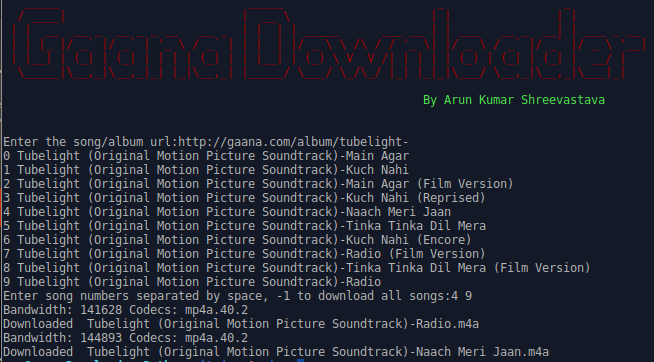

# Gaana Downloader in Python
A simple Downloader that i coded in my free time while i was reading how websites stream their content and so decided to code a downloader to learn a bit more in depth.

This is my downloader to download songs from [Gaana.com](http://gaana.com) website, an online music streaming website.

Prerequisite
====
You need Python2.7 and m3u8 library installed installed for the script to work.

I used python2.7 but you can also use python3, just make changes in the print statements.

Python2.7		- https://www.python.org/download/releases/2.7/ 
m3u8			- https://github.com/globocom/m3u8

You can also install m3u8 using pip
<pre>
pip install m3u8
</pre>

Usage
====
<pre>python2.7 gaana_downloader.py</pre>

When asked for the song url enter the url of the song/album from the Gaana website. Then enter the song number you want to download or -1 if you want to download all songs from the list.

Final Note
====
This is not an exploit nor it will be one in the future. This just emulated what an website does and Gaana.com will feel as if someone is streaming the song from their website. In fact you can download what you can stream.

Disclaimer
====
This is for education purposes for someone who wish to learn how streaming works. I should not be held responsible for misusage of the script or damage caused because of it. Use it at your own risk.

Author
====
Arun Kumar Shreevastava